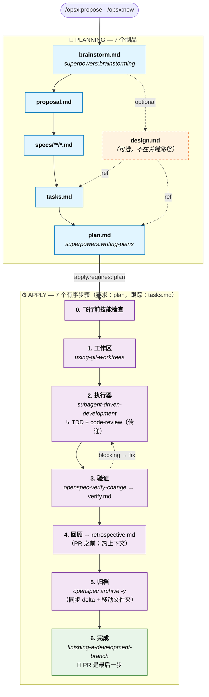

# superpowers-bridge Schema

[English](./README.md) · [繁體中文](./README.zh-TW.md) · [简体中文](./README.zh-CN.md)

> 将 OpenSpec 的制品治理（**做什么**）与 [obra/superpowers](https://github.com/obra/superpowers) 执行技能（**怎么做**）桥接为单一工作流。增加了证据优先的 `retrospective` 制品，填补了 Superpowers 原生不覆盖的空白。
>
> 集成完全在 prompt 层实现——未修改 Superpowers 源码，未改动 OpenSpec CLI。Schema 版本：v1。

---

## 安装

### 方式一：Claude Code 一句话 prompt（推荐）

将以下内容复制到 Claude Code 项目根目录执行：

```
Install the superpowers-bridge schema for OpenSpec into this project:

1. Verify the project has an `openspec/` directory (run `openspec init` if missing).
2. Clone https://github.com/JiangWay/openspec-schemas to a temp dir.
3. Copy the `superpowers-bridge/` subdirectory to `openspec/schemas/superpowers-bridge/`.
4. Run `openspec schema validate superpowers-bridge` to verify.
5. Run `openspec schemas` and confirm `superpowers-bridge` is listed.
6. If a CLAUDE.md exists at the project root, ask me whether to insert the workflow-routing fragment from `openspec/schemas/superpowers-bridge/templates/adopters/CLAUDE.md.fragment.<locale>.md` (auto-detect locale from existing CLAUDE.md content; default zh-TW for Traditional Chinese, no suffix for English). If I say yes, append the fragment as a new section. If no CLAUDE.md exists, skip.
7. Clean up the temp directory.
8. Verify Superpowers plugin is installed by running `claude plugin list`.
   If not listed, run `claude plugin install superpowers@claude-plugins-official`.
9. Show me the final state.
```

### 方式二：手动 bash（CI / 非 Claude 环境）

```bash
git clone https://github.com/JiangWay/openspec-schemas /tmp/oss
cp -R /tmp/oss/superpowers-bridge ~/your-project/openspec/schemas/superpowers-bridge

# 可选：插入 workflow-routing fragment 到 CLAUDE.md
# cat /tmp/oss/superpowers-bridge/templates/adopters/CLAUDE.md.fragment.md       # English
# cat /tmp/oss/superpowers-bridge/templates/adopters/CLAUDE.md.fragment.zh-TW.md # zh-TW

rm -rf /tmp/oss
cd ~/your-project
openspec schema validate superpowers-bridge
claude plugin install superpowers@claude-plugins-official  # 如尚未安装
```

### 方式三：Agent 安装（OpenCode 等使用 AGENTS.md 的环境）

如果项目根目录有 `AGENTS.md` 而非 `CLAUDE.md`（或你使用 OpenCode 等 Agent CLI），将以下内容粘贴到项目根目录执行：

```
安装 superpowers-bridge schema 到本项目：

1. 检查项目是否有 `openspec/` 目录（如无，运行 `openspec init`）。
2. 克隆 https://github.com/jijiezheng/openspec-schemas.git 到临时目录。
3. 将 `superpowers-bridge/` 子目录复制到 `openspec/schemas/superpowers-bridge/`。
4. 运行 `openspec schema validate superpowers-bridge` 验证。
5. 运行 `openspec schemas` 确认 `superpowers-bridge` 已列出。
6. 如果项目根目录有 `AGENTS.md`，询问是否插入 workflow-routing fragment（来源：`openspec/schemas/superpowers-bridge/templates/adopters/AGENTS.md.fragment.zh-CN.md`，适用于简体中文 Agent）。如无 `AGENTS.md`，跳过此步。
7. 清理临时目录。
8. 展示最终状态。
```

---

## 升级现有安装

如果项目已有 `openspec/schemas/superpowers-bridge/`，想拉取最新版本（例如获取新的"Entry & exit gates"文档和 adopter CLAUDE.md fragment），使用以下升级方式之一。

### 升级方式一：Claude Code 一句话 prompt（推荐）

在项目根目录，将以下内容复制到 Claude Code：

```
Upgrade the superpowers-bridge schema in this project:

1. Verify `openspec/schemas/superpowers-bridge/` already exists (upgrade, not fresh install). If missing, abort and tell me to use the install instructions instead.
2. Clone https://github.com/JiangWay/openspec-schemas to a temp dir.
3. Show me the diff between the local `openspec/schemas/superpowers-bridge/` and the cloned `superpowers-bridge/` (use `diff -ruN`). Wait for my ack before overwriting.
4. After my ack, overwrite the local schema dir with the cloned one.
5. Run `openspec schema validate superpowers-bridge` to verify.
6. Check whether this project has `CLAUDE.md` at the repo root.
   - If yes: scan it for an existing workflow-routing section referencing superpowers-bridge.
     - If found: show me the diff between that section and `superpowers-bridge/templates/adopters/CLAUDE.md.fragment.<locale>.md`. Wait for my ack before replacing.
     - If not found: ask whether to insert the new fragment from `templates/adopters/CLAUDE.md.fragment.<locale>.md`.
   - If no CLAUDE.md exists: skip.
7. Clean up the temp directory.
8. Show me the final state.
```

> `<locale>` 如果 CLAUDE.md 是繁体中文默认为 `zh-TW`，否则无后缀（English）。Claude 从现有 CLAUDE.md 内容检测。

### 升级方式二：手动 bash

```bash
# 1. 获取最新包
git clone https://github.com/JiangWay/openspec-schemas /tmp/oss-upgrade

# 2. 先查看 diff（不要盲目覆盖）
diff -ruN ~/your-project/openspec/schemas/superpowers-bridge /tmp/oss-upgrade/superpowers-bridge

# 3. 审核后覆盖
rm -rf ~/your-project/openspec/schemas/superpowers-bridge
cp -R /tmp/oss-upgrade/superpowers-bridge ~/your-project/openspec/schemas/superpowers-bridge

# 4. 验证
cd ~/your-project && openspec schema validate superpowers-bridge

# 5. CLAUDE.md fragment（手动）
# 查看 /tmp/oss-upgrade/superpowers-bridge/templates/adopters/CLAUDE.md.fragment.md
# 与你的 CLAUDE.md 对比，必要时插入/更新对应部分

# 6. 清理
rm -rf /tmp/oss-upgrade
```

### 升级方式三：Agent 升级（OpenCode 等使用 AGENTS.md 的环境）

如果项目根目录有 `AGENTS.md` 而非 `CLAUDE.md`（或你使用 OpenCode 等 Agent CLI），将以下内容粘贴到项目根目录执行：

```
升级 superpowers-bridge schema 到本项目：

1. 检查 `openspec/schemas/superpowers-bridge/` 是否已存在（升级，非全新安装）。如不存在，告知用户使用安装指令。
2. 克隆 https://github.com/jijiezheng/openspec-schemas.git 到临时目录。
3. 展示本地 `openspec/schemas/superpowers-bridge/` 与克隆的 `superpowers-bridge/` 之间的 diff（使用 `diff -ruN`）。等用户确认后再覆盖。
4. 用户确认后，用克隆的版本覆盖本地 schema 目录。
5. 运行 `openspec schema validate superpowers-bridge` 验证。
6. 检查项目根目录是否有 `AGENTS.md`：
   - 如有：扫描是否已有引用 superpowers-bridge 的 workflow-routing 章节。
     - 如有：展示该章节与 `superpowers-bridge/templates/adopters/AGENTS.md.fragment.zh-CN.md` 的 diff。等用户确认后再替换。
     - 如无：询问是否插入来自 `templates/adopters/AGENTS.md.fragment.zh-CN.md` 的新 fragment。
   - 如无 `AGENTS.md`：跳过。
7. 清理临时目录。
8. 展示最终状态。
```

### 升级带来什么

| 变更类型 | 内容 | 需要手动操作？ |
|---|---|---|
| README 文档 | 新的"Entry & exit gates"章节（本章的邻居） | 无——纯文档，无运行时影响 |
| 新 `templates/adopters/CLAUDE.md.fragment.*.md` | 供 adopter CLAUDE.md 复制的 fragment | 可选——见上方步骤 6 / prompt 步骤 6 |
| `schema.yaml` | **不变** | 无——schema 图和说明保持 v1 |

> 此次升级**不会**修改 `schema.yaml`，因此**不会**破坏任何进行中 change 的中间状态。如果你在变更中途（brainstorm / design / specs / ...），可以继续无需重启。

> 如果未来升级结构性修改了 `schema.yaml`（制品增删、PRECHECK 变更），README 会增加版本字段和迁移指南；v1 → v1.x 纯文档变更无需迁移。

---

## 这个 schema 解决什么问题？

OpenSpec 治理**做什么**（制品生命周期：proposal / specs / tasks / verify 等）。Superpowers 治理**怎么做**（执行规范：brainstorming、writing-plans、TDD、code review）。各自都很成熟；但在实际开发中交叉使用会暴露三个结构性问题：

1. **输出重复**——brainstorming 将设计输出写入 `docs/superpowers/specs/`；OpenSpec 在 change 目录重新创作 `proposal.md` / `design.md`，内容重叠。
2. **任务碎片化**——OpenSpec 的 `tasks.md`（粗粒度复选框）和 Superpowers 的 `plan.md`（TDD 微步骤）用不同格式、不同位置、不同进度追踪器描述同一工作。
3. **手动编排**——用户每步都要决定调用哪个技能；两个系统互不连接。

### 为什么用自定义 schema 而不是修改现有技能？

考虑过两个替代方案并否决了：

- **在 `config.yaml` 添加自定义字段**（如 `skill_bindings`）：OpenSpec CLI 不识别——无验证、无发现，需编辑多个 SKILL.md 文件。
- **直接编辑 opsx 技能文件**：侵入性强（影响每个 change）且脆弱（SKILL.md 升级时被覆盖）。

自定义 schema 利用 OpenSpec **原生项目级 schema 机制**：CLI 验证结构，`openspec schemas` 自动列出，每个 change 独立选择 schema（`--schema spec-driven` 或 `--schema superpowers-bridge`），不修改任何现有 SKILL.md 或命令文件。

---

## 入口与出口闸门

本 schema 的说明只在通过 `/opsx:*` 命令调用时才触发。如果通过叙述触发 Superpowers 技能——例如说"我们讨论一下架构"——默认行为会绕过 schema。Brainstorming 仍会写入 `docs/superpowers/specs/`，破坏集成的重定向。

本节涵盖三件事：

1. 何时完全不需要进入 schema（直接开 PR）
2. 何时口头头脑风暴应提升为 opsx change
3. 安装后应避免的前门反模式

### 何时不需要进入 schema（直接 PR）

并非每个变更都需要 `change` 目录。以下场景应完全跳过 opsx：

| 场景 | 需要 change？ | 怎么做 |
|---|---|---|
| 新功能 / 新能力 | ✅ 是 | `/opsx:new <name> --schema superpowers-bridge` |
| 破坏性变更 | ✅ 是 | 同上 |
| 架构变更 | ✅ 是 | 同上 |
| Bug 修复（恢复预期行为，无契约变更） | ❌ 否 | 直接 PR |
| 补测试 / 覆盖率 | ❌ 否 | 直接 PR |
| 构建工具调整（linter 规则、覆盖率阈值） | ❌ 否 | 直接 PR |
| 非破坏性依赖升级 | ❌ 否 | 直接 PR |
| 文档更新 / 笔误修复 | ❌ 否 | 直接 PR |
| 配置值微调（无结构性变更） | ❌ 否 | 直接 PR |

> 原则：**流程仪式应与风险成正比**。外部契约、跨系统集成、数据库 schema 变更、合规边界 → 运行 change。笔误、bug 修复、超时调整 → 直接 PR。模糊情况下使用下方 5 条件检查表。

### 何时口头头脑风暴应提升为 change

如果 `superpowers:brainstorming` 是通过叙述触发的（"我们头脑风暴一下架构"），且项目已安装此 schema，则 brainstorming 输出**禁止**落在 `docs/superpowers/specs/`——那会绕过 schema 的输出重定向，产生孤立制品。

正确流程：口头继续头脑风暴，直到满足以下全部 5 条，然后提升为 `/opsx:propose` 或 `/opsx:new`，使商定的设计落入 `openspec/changes/<name>/brainstorm.md`。

1. **范围已锁定**——一句话描述包含什么 / 不包含什么，且范围不会在每轮中持续扩大
2. **主要设计分歧已解决**——已权衡各方案并选其一；待定项是**明确的 TBD**（有负责人和影响范围说明），而非"还没想到"
3. **跨系统依赖已梳理**——每项依赖明确：就绪 / 可 mock / 确实未知
4. **验收条件可陈述**——具体通过条件（如 `./mvnw clean verify` 通过 + N 项具体交付物）
5. **对话正在收敛**——最近 1-2 轮是确认，而非新的"那如果...呢"分支

任一条件缺失，继续头脑风暴。5 条全部满足时：
- 模型**应主动提议**"看起来可以进入 `/opsx:propose` 了——要发起 change 吗？"
- 用户**也可能主动说**"以此开一个 opsx change"
- 无论哪种方式，**提升需要人类明确确认**——绝不自动触发

### 前门反模式

| 反模式 | 为什么错了 | 正确做法 |
|---|---|---|
| schema 安装后仍允许 brainstorming 写入 `docs/superpowers/specs/` | 绕过 [schema.yaml](./schema.yaml) 第 35-39 行的重定向；产生孤立制品 | 写入 `openspec/changes/<name>/brainstorm.md` |
| 允许 writing-plans 写入 `docs/superpowers/plans/` | 同上原因（schema.yaml 第 169-171 行） | 写入 `openspec/changes/<name>/plan.md` |
| 在有未解决阻塞性 TBD 时提升为 opsx | 这些 TBD 也会阻塞 apply 阶段；提升只是推迟了同一问题 | 先解决 TBD |
| 为 bug 修复 / 笔误 / 配置微调发起 change | 流程仪式超过实际风险；降低交付速度却无价值 | 直接 PR |

---

## 工作流与集成

### 制品 DAG

```text
brainstorm ──→ proposal ──→ specs ──→ tasks ──→ plan ──→ [apply] ──→ verify ──→ retrospective
                  │                     ↑
                  └──→ design ──────────┘
                       (optional)
```

与 `spec-driven` 的区别：

| | spec-driven | superpowers-bridge |
|---|---|---|
| 入口 | proposal（手动） | **brainstorm**（调用 brainstorming 技能） |
| 计划层 | tasks（粗粒度） | tasks + **plan**（TDD 微步骤） |
| apply 要求 | tasks | **plan** |
| apply 方式 | 标准逐任务 | **worktree + subagent-driven-development**（含 TDD + code-review 传递） |
| apply 后 | （无） | **verify** + **retrospective** 制品 |
| 新增制品 | — | brainstorm, plan, verify, retrospective |

### 生命周期（apply 编排 + 时序说明）

上方制品 DAG 显示**文件存在**依赖。下方运行时生命周期增加 apply 阶段的有序步骤和**图边与实际生产顺序之间的时间偏移**。



ASCII 版（CLI 可读）：

```text
PLANNING ━━━━━━━━━━━━━━━━━━━━━━━━━━━━━━━━━━━━━━━━━━━━━━━━━━━━━━
  brainstorm.md ──┬─→ proposal.md ──→ specs/**/*.md ──→ tasks.md ──→ plan.md
                  └─→ design.md (可选，作为 tasks/plan 的参考)
                                                                       │
                          apply.requires: [plan], apply.tracks: tasks  ▼
APPLY ━━━━━━━━━━━━━━━━━━━━━━━━━━━━━━━━━━━━━━━━━━━━━━━━━━━━━━━━
  0. 飞行前技能检查
  1. superpowers:using-git-worktrees
  2. superpowers:subagent-driven-development (+ TDD + code-review 传递)
  3. openspec-verify-change → verify.md ◄┐
                              │           │ blocking → fix
                              ▼           │
  4. retrospective.md（PR 之前；热上下文）
  5. openspec archive -y（同步 delta + 移动文件夹）
  6. superpowers:finishing-a-development-branch（🏁 PR 是最后一步）
```

> **时序说明**（"六个设计要点"第 6 条的完整理由）：
> - `verify.md` 在图中声明 `requires: plan`，但实际在 apply 步骤 3 内产生。
> - `retrospective.md` 声明 `requires: verify`，且按步骤 4 在 **PR 之前**产生——因此 PR diff 包含完整归档周期（所有制品完成、spec 同步、change 文件夹移至 archive/）。
> - `requires:` 边是 OpenSpec 图引擎的文件存在依赖；运行时顺序在说明文本中。

### 七个 Superpowers 接触点

| # | Superpowers 技能 | 调用位置 | 触发方式 |
|---|---|---|---|
| 1 | `superpowers:brainstorming` | `brainstorm` 制品说明 | 直接调用（带 PRECHECK） |
| 2 | `superpowers:writing-plans` | `plan` 制品说明 | 直接调用（带 PRECHECK） |
| 3 | `superpowers:using-git-worktrees` | apply 步骤 1 | 直接调用 |
| 4 | `superpowers:subagent-driven-development` | apply 步骤 2 | 直接调用 |
| 5 | `superpowers:test-driven-development` | （在 #4 内激活） | **传递** |
| 6 | `superpowers:requesting-code-review` | （在 #4 内激活） | **传递** |
| 7 | `superpowers:finishing-a-development-branch` | apply 步骤 4 | 直接调用 |

另有一个 OpenSpec 内置：`openspec-verify-change`（apply 步骤 3，产生 `verify.md`）。

> **无 `executing-plans` 回退。** 本 schema 有主见：要求有 subagent 能力的平台（Claude Code、Codex 等）。备选执行器 `superpowers:executing-plans` 不会传递激活 TDD 或 code-review（经核验其 [SKILL.md](https://github.com/obra/superpowers/blob/main/skills/executing-plans/SKILL.md)）——回退会悄然降级 Superpowers 的核心价值。如果平台不支持 subagent，使用内置的 `spec-driven` schema。

### 输出重定向

Superpowers 技能有默认输出路径（如 brainstorming 写入 `docs/superpowers/specs/`）。本 schema 的制品说明**通过注入上下文覆盖**该行为，将输出重定向到 change 目录：

- brainstorming → `openspec/changes/<name>/brainstorm.md`（+ 可选 `design.md`）
- writing-plans → `openspec/changes/<name>/plan.md`

通过调用时注入上下文实现，未修改技能源码。

---

## 使用方法

### 快速流程（推荐）
```bash
/opsx:ff my-feature    # 一键：脚手架 + brainstorm + proposal + design + specs + tasks + plan
/opsx:apply            # worktree + subagent-driven-development（含 TDD + code-review）
/opsx:verify           # 产生 verify.md（5 项检查）
/opsx:continue         # → retrospective（产生 retrospective.md，6 部分）
/opsx:archive          # 归档
```

### 逐步流程
```bash
/opsx:new my-feature --schema superpowers-bridge
/opsx:continue         # → brainstorm（交互式对话）
/opsx:continue         # → proposal
/opsx:continue         # → design（可选，仅在需要解释技术决策时）
/opsx:continue         # → specs
/opsx:continue         # → tasks
/opsx:continue         # → plan
/opsx:apply            # → 实现 + worktree + subagent-driven-development
/opsx:verify           # → verify.md（apply 后，运行 5 项检查）
/opsx:continue         # → retrospective.md（verify 后，证据优先 6 部分）
/opsx:archive
```

### 切换回 spec-driven
```bash
# 为一个 change 使用不同 schema
/opsx:new my-simple-fix --schema spec-driven

# 或在 openspec/config.yaml 中更改项目默认：schema: spec-driven
```

---

## Apply 阶段详解

`/opsx:apply` 触发 [schema.yaml](./schema.yaml) 中 `apply.instruction` 的步骤：

#### 0. 飞行前——验证所需 Superpowers 技能

继续前确认以下技能已安装：

- `superpowers:using-git-worktrees`
- `superpowers:subagent-driven-development`（传递：`test-driven-development`、`requesting-code-review`）
- `superpowers:finishing-a-development-branch`

技能缺失 → STOP 并给出明确错误。无静默回退，本 schema 内无手动模式。用户应安装 Superpowers 或切换到内置的 `spec-driven` schema。

> v0 版本曾在此处放置"自动提交 change 制品到当前分支"步骤。在 [PR #970 review](https://github.com/Fission-AI/OpenSpec/pull/970) 后移除：处理未跟踪 change 目录是 worktree 技能的职责，非 schema 职责。

#### 1. 工作区——`superpowers:using-git-worktrees`

创建 `.worktrees/<change-name>/`，切换到新分支，运行 setup，确认干净的测试基线。

#### 2. 执行器——`superpowers:subagent-driven-development`

主 agent 读取 `plan.md`，为每个微任务派遣新的 subagent。每个 subagent 传递激活：

- **TDD**（`superpowers:test-driven-development`）：写失败测试 → 看它失败 → 最小代码 → 通过；无前置测试的生产代码会被删除
- **每任务 code review**（`superpowers:requesting-code-review`）：spec 合规审查 + 代码质量审查；关键问题阻止向前推进

粗粒度 `tasks.md` 复选框在各任务完成时打勾。所有任务后，最终 code review 覆盖整个实现。

本 schema **不支持** `superpowers:executing-plans` 作为回退。见下方"六个设计要点"第 4 条理由。

#### 3. 验证——`openspec-verify-change`

从 5 项检查产生 `verify.md`：结构验证（`openspec validate --all --json`）、任务完成、delta-spec 同步状态、design/specs 一致性（非阻塞警告）、实现信号（已提交代码）。

失败路由回对应制品修复；verify 可重新运行。

> **步骤 4–6 是验证后的标准序列：retro → archive → PR。顺序颠倒会产生不完整的 PR**（retro + archive 作为后续提交出现，失去热上下文）。

#### 4. 回顾——`retrospective` 制品（推荐；按 Entry & exit gates 跳过规则，trivial 修复可跳过）

证据优先的 6 部分反思（收获 / 失误 / 计划偏差 / 技能合规 / 意外 / 可推广项）。每项声明引用 commit / 文件 / 可衡量事实。流程嵌入制品说明中——无需外部技能（设计 spec 决策 3 将 Claude Code 插件打包延至 v1.x）。

在开 PR **之前**写，这样 retro 落在同一 PR diff 中。

#### 5. 归档——`openspec archive -y`（或 `/opsx:archive`）

将 delta specs 同步到 `openspec/specs/<capability>/spec.md`，将 change 文件夹移至 `openspec/changes/archive/YYYY-MM-DD-<name>/`。在开 PR **之前**运行，这样 diff 反映完整归档周期（所有制品完成、spec 同步、文件夹在 archive/ 下）。

#### 6. 完成——`superpowers:finishing-a-development-branch`

确认测试绿色，呈现合并 / PR / 保留分支 / 丢弃选项，清理 worktree。**PR 是最后一步**——如果 retro 或 archive 还没做，先完成它们。

---

## CLI 速查表

| 场景 | 命令 |
|---|---|
| 首次克隆项目 | `bash scripts/install-git-hooks.sh` |
| 新 change（交互式） | `/opsx:new <name> --schema superpowers-bridge` 然后 `/opsx:continue` |
| 新 change（一键） | `/opsx:ff <name>` |
| 恢复中断的 change | `/opsx:continue <name>` |
| 开始实现 | `/opsx:apply <name>` |
| 手动验证 | `/opsx:verify <name>` |
| 归档 | `/opsx:archive <name>` |
| 使用内置（跳过 brainstorm） | `/opsx:new <name> --schema spec-driven` |
| 列出项目中所有 schema | `openspec schemas` |
| 查看 change 进度 | `openspec status --change <name> --json` |
| 列出活跃 changes | `openspec list` |
| 验证整个项目 | `openspec validate --all --json` |

---

## 六个值得记住的设计要点

### 1. 技能名 PRECHECK（第 1 层能力检测）

每个调用 Superpowers 技能的制品 / apply 步骤在其说明开头运行 PRECHECK，确认技能存在于 LLM 可用技能列表中。**技能缺失 = STOP，无静默回退。** 这是 [PR #970 review](https://github.com/Fission-AI/OpenSpec/pull/970) 关切点 #1 第层的具体答案——故障大声、故障提前。

### 2. Schema 级 vs prompt 级集成

集成完全在 `instruction:` 字段（纯 prompt）中。如果 Superpowers 升级了技能行为，schema 不变。只有在技能被重命名或移除时才动 `schema.yaml`。

### 3. 传递依赖显性化

TDD 和 code-review 通常隐藏在 `subagent-driven-development` 的 SKILL.md 内部。本 schema 的 apply 步骤 2a 说明显式列出这两个传递激活，使读者一览"apply 期间实际发生了什么"。

### 4. 有主见：仅限 subagent 平台，无手动回退

本 schema 要求有 subagent 能力的平台（Claude Code、Codex 等）。备选执行器 `superpowers:executing-plans` **不会**传递激活 TDD 或 code-review（经核验其 [SKILL.md](https://github.com/obra/superpowers/blob/main/skills/executing-plans/SKILL.md)——其正文未提及两者，集成部分也省略了 `test-driven-development` 和 `requesting-code-review`）。回退会悄然失去 Superpowers 给本集成的核心价值。本 schema 选择在步骤 0 大声失败并引导用户使用内置 `spec-driven` schema。

### 5. verify 和 retrospective 的证据优先 PRECHECK（第 2 层能力检测）

每个时间敏感的制品在其说明开头运行具体的 shell 证据检查：

- **verify**：`git log <base>..HEAD | wc -l > 0` AND `grep -c '^- \[x\]' tasks.md > 0`
- **retrospective**：`test -f verify.md` AND `! grep -q '^- \[x\] ❌ FAIL' verify.md`

LLM 无需解释时间文本——它运行命令并读取结果。这是关切点 #1 的第 2 层 / 关切点 #2 的缓解措施。

### 6. verify 和 retrospective 是时间不匹配的制品（已知限制）

`verify.requires: [plan]` 和 `retrospective.requires: [verify]` 是 schema 图中的文件存在依赖，但各自的说明都明确声明"MUST run AFTER apply phase / verify pass"。这是有意的不对齐——OpenSpec 引擎只检查前置文件是否存在。引擎原生修复等待上游的 `post_apply` 阶段概念（类似于 spec-kit 的 `after_implement` hook）；证据优先的 PRECHECK 是 v1 的缓解措施。

---

## 兼容性

下表记录通过验证的 upstream 版本。CI 会每周重跑验证（见 [version-check workflow](../.github/workflows/version-check.yml)）。

| superpowers-bridge | OpenSpec CLI | Superpowers plugin | 最后验证 |
|---|---|---|---|
| v1 | `1.3.1` | `v5.1.0` | 2026-05-06 |

### Known breaking changes

目前尚无。未来 schema graph 结构性变动（artifact 增减、`requires:` edge 变动、PRECHECK 变动）会记录在这里并附 migration note。

### 哪些会自动侦测、哪些不会

- ✅ **会自动侦测** —— 结构性破坏（新版 OpenSpec CLI 让 `openspec schema validate superpowers-bridge` 失败）。[validate-schemas workflow](../.github/workflows/validate-schemas.yml) 在每次 push/PR 跑；[version-check workflow](../.github/workflows/version-check.yml) 每周对最新版本跑，矩阵落后或 validate 失败就开 / 更新 issue。
- ⚠️ **不会自动侦测** —— Superpowers skill 的行为变动（skill 改名、改写 prose 而影响 PRECHECK 语义、传递依赖变动）。version-check workflow 侦测到新版时开 issue，提醒人类去读 release notes。

采用者：版本 pin 在表中之上即可。要查自己项目的 runtime 现况，跑 `openspec list` + `openspec schemas` + `claude plugin list`。

---

## 一些值得知道的设计决策

### 为什么 `brainstorm` 是制品而非 hook

Brainstorming 是需要用户参与的多轮交互对话。将其建模为第一个制品（而非 schema 级 hook）有两个优势：

1. **可跳过**——如果用户已知要构建什么，可直接编写 `brainstorm.md` 而不调用技能。
2. **可追踪**——`openspec status` 报告 brainstorm 完成状态，下游制品显式依赖它。

### 为什么 `plan` 与 `tasks` 分开

`tasks.md` 是粗粒度复选框（"添加 PdfServiceTest"）；`plan.md` 是微步骤（"搭建测试 → 写 downloadPdf 测试 → 运行 → 提交"）。它们服务不同目的：

- `tasks.md` → 追踪整体进度（apply 阶段的 `tracks` 字段解析这些复选框）
- `plan.md` → 逐步引导 subagent（执行器的输入）

Apply 要求 `plan`（而非 `tasks`）因为执行器需要微步骤；`tracks: tasks.md` 确保进度仍通过粗粒度复选框呈现。

### 回退策略

如果 Superpowers 技能不可用：

- **`brainstorm` / `plan` 制品**——用户可明确选择手动编写制品（PRECHECK STOP 并告知用户；手动覆盖需要用户刻意操作，非静默降级）
- **`apply` 阶段**——本 schema 内无手动回退。PRECHECK 在步骤 0 检查所需技能是否缺失并 STOP。建议路径是为该 change 切换到内置的 `spec-driven` schema。理由：见设计要点 #4——`executing-plans` 不会传递激活 TDD 或 code-review，降级的 apply 阶段会破坏 schema 的目的。

---

## 相关

- [schema.yaml](./schema.yaml) —— 机器可读的 schema 定义
- [templates/](./templates/) —— 各制品的 markdown 模板
- [README.zh-TW.md](./README.zh-TW.md) —— 繁體中文版
- [obra/superpowers](https://github.com/obra/superpowers) —— Superpowers 技能源码
- [Fission-AI/OpenSpec](https://github.com/Fission-AI/OpenSpec) —— OpenSpec
- [OpenSpec PR #970](https://github.com/Fission-AI/OpenSpec/pull/970) —— 驱动本设计的原始 review 讨论
